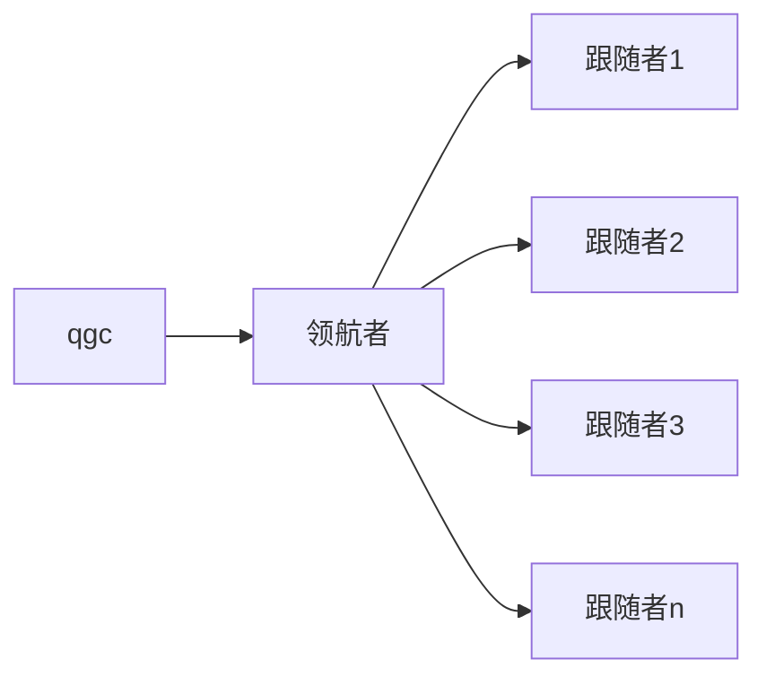
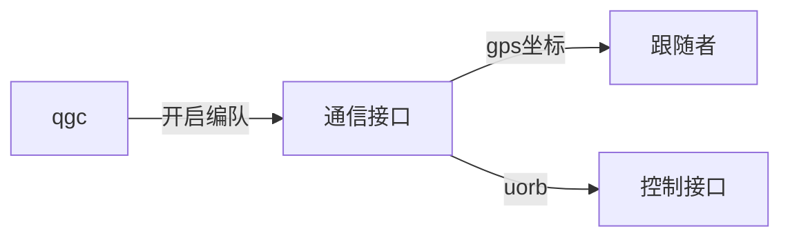

# Swarm

* [简介](README.md)

本教程适用于对无人机编队开发感兴趣的初学者

PX4固件基于PX4 1.14.0最新稳定版

QGC基于4.3最新稳定版

# 系统架构

通信拓扑：



软件架构：



# 运行步骤

在PX4-Autopilot目录下打开终端

首先启动五架从机仿真

```
./Tools/simulation/gazebo-classic/sitl_multiple_run.sh -m iris -n 5
```

然后启动主机仿真

```
make px4_sitl_default gazebo
```

然后打开配套QGC软件（地址：https://gitee.com/Mbot_admin/qgc-4.3-leader-follow-swarm.git）

点击开始编队


可以看到6架无人机同时起飞，5架从机跟随领航机飞一个正方形后降落